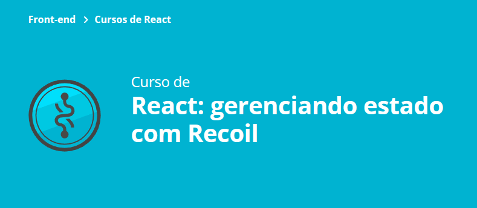
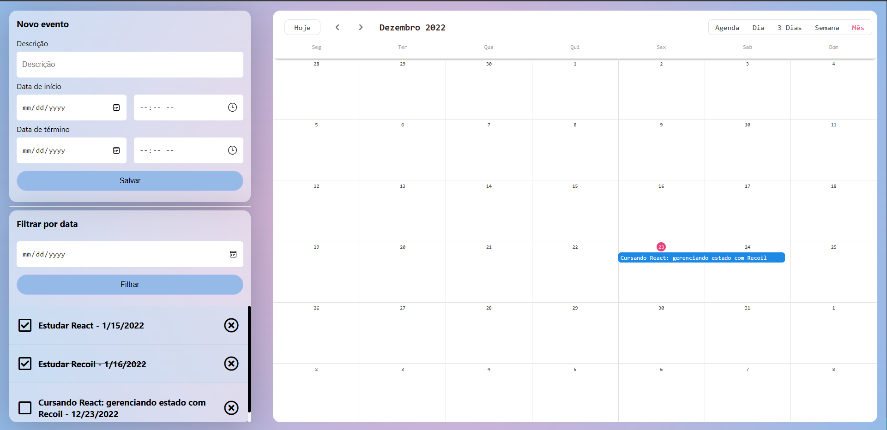

### Aula 1:
- Entendendo o projeto :white_check_mark: 
- Criando o atom (Átomos são as porções que compõem o estado compartilhado do recoil.):white_check_mark:
- Criando eventos com Hooks do Recoil :white_check_mark:
### Aula 2:
- Deletando e Atualizando eventos :white_check_mark:
- Corrigindo bug :white_check_mark:
- Refatorando código duplicado (com hook personalizado) :white_check_mark:
### Aula 3:
- Encapsulando a adição de eventos :white_check_mark:
- Desafio: colocar as exclusões em um hook personalisado :white_check_mark:
- Lista de eventos via hook :white_check_mark:
### Aula 4: 
- Derivar estados com seletores (Mantendo assim a responsabilidade bem definida para cada parte do sistema) :white_check_mark:
- Adicionar funcionalidades de forma incremental (Primeiro, colocamos o filtro para funcionar. Na sequência, melhoramos a implementação e extraímos a lógica) :white_check_mark:
### Aula 5:
1. Criar seletores assíncronos :white_check_mark:
    - Integrando assim o recoil com uma API REST.
2. Definir um valor inicial dinâmico para o átomo :white_check_mark:
    - Ao definir o seletor async como valor padrão para o átomo, todos os eventos iniciais passam a vir da API.
3. Criar uma ferramenta de depuração :white_check_mark:
    - Agora fica mais simples de entender as mudanças no estado, uma vez que implementamos um componente que faz log cada vez que o estado é manipulado.
 

# Calendário
Calendário responsável por adicionar e remover eventos à ele. <br>
Você pode interagir com essa aplicação e dizer que um evento foi completado, você pode deletar um evento do calendário, você pode mover um evento no draggling drop e mudar o horário e o dia dele, quando ele vai acontecer.





## 🔨 A saber sobre o projeto

O gerenciamento de estado dele está direto no “app.tsx” com um monte de prop drilling.
O que podemos fazer e como o Recoil pode nos ajudar a atingir um bom resultado.

## ✔️ Técnicas e tecnologias utilizadas

Se liga nessa lista de tudo que foi usado nesse treinamento:

- `React`
- `React Hooks`
- `TypeScript`
- `Recoil`

## 🛠️ Abrir e rodar o projeto

Para abrir e rodar o projeto: Na pasta Calendario-event-tracker-recoil execute `npm i` para instalar as dependências e `npm start` para inicar o projeto.

Depois, acesse <a href="http://localhost:3000/">http://localhost:3000/</a> no seu navegador.

## 🛠️ Abrir e rodar Json Server
abra o repositório no vscode.
No terminal digite:
```
npm install json server
```
rodar o json server: 
```
json-server --watch db.json
```
Ou (se o json-server não foi instalado globalmente)
```
npx json-server --watch db.json
```

Se você tiver a extensão Live Server no VScode não é necessário o passo abaixo: <br>
Rodar: 
```
browser-sync start --server --file . --host --port 5000 --startPath admin/telas/lista_cliente.html
```


## 📚 Mais informações do curso

Busque na plataforma da Alura o curso **React: gerenciando estado com Recoil** publicado na Escola Frontend.
